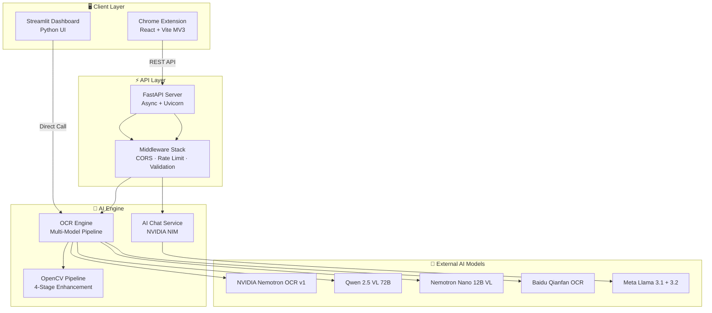
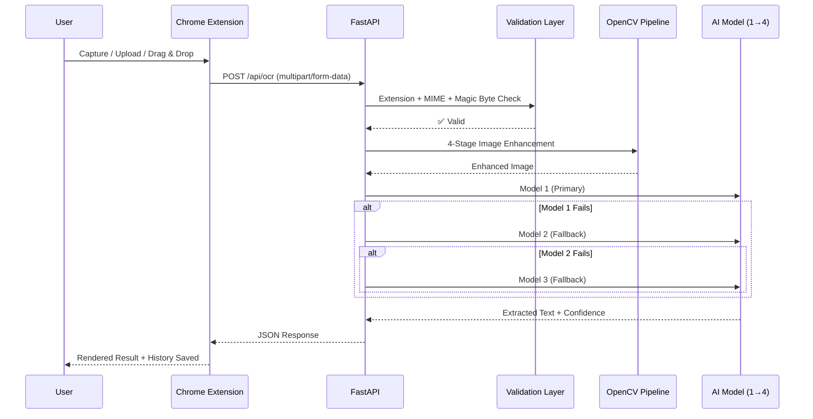

<p align="center">
  
</p>

<h1 align="center">📖 Pagixo AI - Advanced Math & Text OCR</h1>

<p align="center">
  <b>🎓 The most accurate OCR detection system for students, researchers, and professionals!</b>
</p>

<p align="center">
  
  
  
  
  
  
  
</p>

<p align="center">
  <a href="#-quick-start">Quick Start</a> •
  <a href="#-features">Features</a> •
  <a href="#-architecture">Architecture</a> •
  <a href="#-tech-stack">Tech Stack</a> •
  <a href="#-api-reference">API Reference</a> •
  <a href="#-security">Security</a> •
  <a href="#-roadmap">Roadmap</a>
</p>

---

## 🎯 What is Pagixo AI?

**Pagixo AI** is a production-grade OCR system that extracts text, mathematical equations, and structured content from images and PDFs with **PhD-level precision**. It combines a **Chrome Extension**, **Streamlit Dashboard**, and **FastAPI backend** into a unified full-stack AI platform.

> **The Problem:** Every existing OCR tool breaks on complex math, misses LaTeX formatting, or forces page-by-page scanning. Pagixo was built to end this.

<p align="center">
  
</p>

---

## 📊 Performance at a Glance

| Metric | Value |
|:---|:---|
| **Single Page OCR** | 3–8 seconds |
| **25-Page Batch** | < 5 minutes (concurrent) |
| **LaTeX Accuracy** | 95%+ (Qwen 2.5 VL 72B) |
| **Image Enhancement** | < 1 second |
| **AI Models Available** | 4 vision models |
| **Max PDF Pages** | 30 pages per batch |
| **AI Chat Response** | < 3 seconds |

---

## ⚡ Features

### 1. Multi-Model AI + Smart Fallback

Pagixo doesn't rely on a single model. It runs a **multimodal inference pipeline** across 4 vision models with automatic cascading fallback:

| Model | Provider | Strength | Tier |
|:---|:---|:---|:---|
| `nemotron-ocr-v1` | NVIDIA API | General text, high speed | Primary |
| `qwen-2.5-vl-72b` | OpenRouter | Math & LaTeX precision | Math-focused |
| `nemotron-nano-12b-vl` | OpenRouter | Vision-language hybrid | Free fallback |
| `baidu-qianfan-ocr-fast` | OpenRouter | Speed-optimized OCR | Free fallback |

**Smart Routing Logic:**
- Subject-aware routing — math subjects auto-route to Qwen 2.5 VL
- If the primary model fails → auto-switches to the next in the chain
- Zero downtime — your scan **never** breaks

---

### 2. Computer Vision Auto-Enhancement (OpenCV)

Every image passes through a **4-stage computer vision pipeline** before OCR even starts:

```
┌─────────────┐    ┌──────────────────────┐    ┌────────────────┐    ┌──────────────────┐
│   CLAHE     │───▶│ Adaptive Threshold   │───▶│  Auto-Deskew   │───▶│ Edge Detection   │
│ (Contrast)  │    │ (Gaussian, C=2)      │    │ (Hough Lines)  │    │ (Canny 50/150)   │
└─────────────┘    └──────────────────────┘    └────────────────┘    └──────────────────┘
```

| Stage | Algorithm | What It Fixes |
|:---|:---|:---|
| **CLAHE** | Contrast Limited Adaptive Histogram Equalization | Low contrast, dark images |
| **Threshold** | Adaptive Gaussian Thresholding (block=11, C=2) | Uneven lighting, shadows |
| **Deskew** | Hough Line Transform → Median angle rotation | Tilted/rotated scans |
| **Edge Detection** | Canny (threshold 50/150) | Blurry text boundaries |

**Result:** Blurry phone photos, skewed scans, and low-contrast documents are automatically fixed.

---

### 3. Multi-Page Rendering (25 Pages in 1 Click)

| Feature | Detail |
|:---|:---|
| **Concurrent Workers** | `ThreadPoolExecutor(max_workers=3)` — 3 parallel extraction threads |
| **Rendering** | PyMuPDF at **200 DPI** high-resolution |
| **Progress** | Real-time progress bar with page-level status |
| **Stitching** | Ordered assembly preserves document structure |
| **Safety Limit** | 30-page cap to prevent browser crashes |
| **Temp Cleanup** | Per-page temp files auto-deleted after processing |

---

### 4. Text Spotting with Bounding Boxes

Not just *what* the text says — but *where* it is:

- **Color-coded bounding boxes** with semi-transparent lime green overlays
- **Numbered badges** for easy reference (black background, green text)
- **Resolution-independent** — coordinates normalized to 1000×1000
- **RGBA alpha compositing** for non-destructive overlays
- **Multi-format support** — handles both OpenRouter JSON and NVIDIA's `text_detections` format
- **4-stage JSON parsing fallback**: `ast.literal_eval` → `json.loads` → Regex parser → Error

---

### 5. AI Chat with Advanced Reasoning

After extracting text, you can **have a conversation** with your document:

| Capability | Detail |
|:---|:---|
| **Text Reasoning** | Meta Llama 3.1 8B via NVIDIA NIM |
| **Vision Analysis** | Meta Llama 3.2 11B Vision for image-based Q&A |
| **Chat History** | Thread-safe `deque(maxlen=50)` with full context |
| **Preset Prompts** | "Summarize", "Solve step by step", "Explain", "Translate" |
| **Context Awareness** | Knows scan type (upload / capture / visible page) |
| **Rate Limit Handling** | Graceful 429 detection with user-friendly messages |

**Example interactions:**
```
You: "Solve the equation on this page step by step"
You: "Summarize this research paper in 3 bullet points"
You: "Translate this paragraph to English"
You: "What is the eigenvalue of matrix A?"
```

---

### 6. Subject-Context Intelligence

The AI doesn't just read pixels — it understands the **domain**:

| Subject | Context Injection |
|:---|:---|
| **Physics** | Preserves vector notation (v₀, aₓ), SI units, Greek symbols (ω, θ, λ) |
| **Calculus** | Integral bounds, limit notation, derivative operators (d/dx, ∂/∂x) |
| **Linear Algebra** | Matrix notation, transpose (Aᵀ), eigenvalues, determinants |
| **Chemistry** | Molecular formulas, reaction arrows (→, ⇌), oxidation states |
| **Statistics** | Probability P(A\|B), distribution notation, Greek (μ, σ, β) |
| **Computer Science** | Big-O notation, pseudocode, logical operators |
| **Auto-detect** | AI identifies the subject automatically before extraction |

Each subject injects a specialized prompt that guides the AI's extraction behavior. This dramatically improves accuracy for domain-specific notation.

---

### 7. LaTeX Rendering & Export

| Feature | Detail |
|:---|:---|
| **Live Rendering** | MathJax-powered LaTeX rendering in-browser |
| **Dual View** | Toggle between "Rendered" and "Raw LaTeX" tabs |
| **Smart Preprocessing** | Auto-converts `\[...\]` → `$$...$$`, `\(...\)` → `$...$` |
| **Array Block Detection** | Auto-wraps orphaned `\begin{array}` blocks |
| **Fallback Rendering** | If MathJax fails → displays as code block |
| **Export Formats** | `.md` (Markdown), `.tex` (LaTeX document), Clipboard copy |
| **Correction System** | Edit extracted text → save diffs to `corrections.jsonl` |

---

### 8. Chrome Extension (Manifest V3)

A full-featured Chrome Extension built with **React + Vite**:

#### Keyboard Shortcuts

| Shortcut | Action |
|:---|:---|
| `Ctrl+Shift+S` | Instant area capture from any webpage |
| `Ctrl+F` | Search through extracted text |

#### Right-Click Context Menu

| Menu Item | What It Does |
|:---|:---|
| 📸 Scan with Pagixo OCR | Scan any image on a webpage |
| 🔗 Scan Linked Image | Scan an image URL |
| 📄 Scan Visible Page | Capture the entire visible tab |

#### Input Methods

| Method | Description |
|:---|:---|
| **Area Capture** | Click and drag to select a region |
| **Drag & Drop** | Drop any image/PDF directly into the side panel |
| **File Upload** | Traditional file picker |
| **Camera** | Mobile camera capture |
| **Visible Page** | Capture entire browser viewport |

#### Extension Architecture

| Component | Technology |
|:---|:---|
| **Side Panel** | React SPA with real-time state management |
| **Background** | MV3 Service Worker (persistent via Chrome APIs) |
| **Content Script** | Injected at `document_idle` on all URLs |
| **Popup** | Quick-access status panel |
| **Styling** | Shadow DOM isolation — zero CSS conflicts |
| **Build** | Vite with custom multi-entry config |

---

### 9. Scan History

Every scan is automatically saved with rich metadata:

| Field | Description |
|:---|:---|
| `filename` | Original file name |
| `confidence` | OCR confidence score (0.0–1.0) |
| `processing_time_ms` | Exact processing duration |
| `text_preview` | First 200 characters |
| `full_text` | Complete extracted content |
| `model_used` | Which AI model processed it |
| `file_type` | MIME type |
| `file_size_bytes` | File size |
| `timestamp` | ISO 8601 timestamp |

- Stored in Chrome's session storage with `deque`-style FIFO management
- One-click restore to view any past scan
- Clear individual entries or bulk clear all
- Relative timestamps ("2m ago", "3h ago")

---

## 🏗 Architecture

### System Overview



### Request Flow



### Directory Structure

```
pagixo-ai/
├── api/                          # FastAPI Backend
│   ├── main.py                   # App entrypoint + lifespan management
│   ├── ocr_engine.py             # Multi-model OCR pipeline
│   ├── models/
│   │   ├── schemas.py            # Pydantic request/response models
│   │   └── chat_models.py        # Chat request/response schemas
│   ├── routers/
│   │   ├── ocr.py                # /api/ocr + /api/history endpoints
│   │   └── chat.py               # /api/chat endpoint
│   ├── services/
│   │   └── nvidia_nim.py         # NVIDIA NIM integration (Chat + Vision)
│   ├── middleware/
│   │   └── cors.py               # CORS configuration
│   ├── Dockerfile                # API container
│   └── requirements.txt          # Python dependencies
│
├── chrome-extension/             # Chrome Extension (MV3)
│   ├── manifest.json             # Extension manifest
│   ├── src/
│   │   ├── background/           # Service Worker
│   │   │   └── index.js          # Command listener, context menus, API calls
│   │   ├── content/              # Content Scripts
│   │   │   └── capture.js        # Area selection, drag & drop
│   │   ├── sidepanel/            # Side Panel (React SPA)
│   │   │   ├── App.jsx           # Main app component
│   │   │   └── components/
│   │   │       ├── ResultViewer.jsx    # OCR result display + LaTeX rendering
│   │   │       ├── AIChatPanel.jsx     # AI chat interface
│   │   │       ├── ChatMessage.jsx     # Chat bubble component
│   │   │       ├── HistoryList.jsx     # Scan history list
│   │   │       ├── ScanProgress.jsx    # Progress indicator
│   │   │       ├── ExportMenu.jsx      # .md/.txt export
│   │   │       └── QuickPrompts.jsx    # AI chat preset prompts
│   │   ├── popup/                # Extension popup
│   │   ├── shared/               # Shared utilities (API, storage, icons)
│   │   └── styles/               # Global CSS
│   └── vite.config.js            # Build configuration
│
├── app.py                        # Streamlit Dashboard (876 lines)
├── enhance_image.py              # OpenCV 4-stage enhancement pipeline
├── docker-compose.yml            # Multi-service orchestration
├── Dockerfile.streamlit          # Streamlit container
├── start-dev.bat / .sh           # Development launch scripts
├── requirements.txt              # Root Python dependencies
└── .env.example                  # Environment template
```

---

## 🛠 Tech Stack

### Backend

| Technology | Role |
|:---|:---|
| **FastAPI** | Async REST API with ASGI (Uvicorn) |
| **Pydantic v2** | Request/response validation with `Field()` constraints |
| **OpenCV** | 4-stage image enhancement (CLAHE → Threshold → Deskew → Edge) |
| **PyMuPDF (fitz)** | PDF → Image rendering at 200 DPI |
| **Pillow (PIL)** | Image manipulation, bounding box rendering, alpha compositing |
| **OpenAI SDK** | Unified client for OpenRouter + NVIDIA API calls |
| **ThreadPoolExecutor** | Concurrent multi-page extraction (3 workers) |
| **python-dotenv** | Environment variable management |

### Frontend — Chrome Extension

| Technology | Role |
|:---|:---|
| **React 18** | Side panel SPA with hooks-based state management |
| **Vite** | Lightning-fast builds with multi-entry bundling |
| **Manifest V3** | Modern Chrome Extension architecture |
| **Shadow DOM** | CSS isolation — zero conflicts with host pages |
| **Service Worker** | Background processing, command listeners, context menus |
| **OffscreenCanvas** | Zero-latency image cropping without DOM manipulation |
| **Chrome Storage API** | Session + local persistence for history and settings |
| **MathJax / KaTeX** | Live LaTeX rendering in the side panel |

### Frontend — Streamlit Dashboard

| Technology | Role |
|:---|:---|
| **Streamlit** | Interactive Python-native web UI |
| **streamlit.components** | Custom HTML/JS for clipboard and rendering |
| **Session State** | Persistent extraction results across reruns |

### AI & Infrastructure

| Technology | Role |
|:---|:---|
| **NVIDIA NIM** | Chat API (Llama 3.1 8B + Llama 3.2 11B Vision) |
| **OpenRouter** | Multi-model OCR routing (Qwen, Nemotron, Baidu) |
| **Docker Compose** | Multi-service container orchestration |
| **Structured Logging** | Timestamped logs with service-level namespacing |

---

## 📡 API Reference

### `POST /api/ocr`

Extract text from an image or PDF.

| Parameter | Type | Required | Description |
|:---|:---|:---|:---|
| `file` | `multipart/form-data` | ✅ | Image (jpg/png) or PDF file |
| `model` | `string` | ❌ | Model override (default: auto-routing) |
| `subject` | `string` | ❌ | Subject context hint |
| `enhance` | `boolean` | ❌ | Enable OpenCV enhancement (default: true) |

**Response:**
```json
{
  "status": "success",
  "text": "Extracted content...",
  "confidence": 0.94,
  "pages": 1,
  "processing_time_ms": 4200,
  "model_used": "nvidia/nemotron-ocr-v1",
  "filename": "lecture_notes.png"
}
```

### `POST /api/chat`

Chat with your extracted document content.

| Parameter | Type | Required | Description |
|:---|:---|:---|:---|
| `question` | `string` | ✅ | User's question (1–4000 chars) |
| `context` | `string` | ❌ | OCR-extracted text for context |
| `history` | `array` | ❌ | Previous chat turns `[{role, content}]` |
| `scan_type` | `string` | ❌ | `upload` / `capture` / `visible_page` |

**Response:**
```json
{
  "answer": "The eigenvalue of matrix A is...",
  "model": "meta/llama-3.1-8b-instruct",
  "tokens_used": 342,
  "error": null
}
```

### `GET /health`

```json
{
  "status": "ok",
  "service": "pagixo-ocr-api",
  "version": "1.0.0",
  "uptime_seconds": 3421.5
}
```

---

## 🔒 Security

Pagixo implements **defense-in-depth** security across every layer:

| Layer | Implementation |
|:---|:---|
| **File Validation** | Triple-layer: extension whitelist + MIME type check + magic byte verification |
| **Upload Limit** | 20MB hard cap with byte-level enforcement |
| **CORS** | Dev/production split with rejection logging |
| **Rate Limiting** | 30 requests/minute per IP with sliding window |
| **API Keys** | Environment variable isolation — never hardcoded |
| **Data Retention** | Zero — temp files auto-deleted after processing |
| **Request Tracing** | Unique `X-Request-ID` per request for audit trails |
| **Transport** | HTTPS encrypted API calls end-to-end |
| **Error Handling** | Sanitized error messages — no stack traces to client |
| **Retry Logic** | Exponential backoff (3 retries) for transient failures |

---

## 🚀 Quick Start

### Prerequisites

- Python 3.10+
- Node.js 18+ (for Chrome Extension build)
- Chrome browser
- API Keys (at least one):
  - [NVIDIA NIM API Key](https://build.nvidia.com/)
  - [OpenRouter API Key](https://openrouter.ai/)

### 1. Clone & Setup

```bash
git clone https://github.com/Abhichy18/Pagixo-AI.git
cd Pagixo-AI

# Create virtual environment
python -m venv .venv
source .venv/bin/activate  # Linux/Mac
.venv\Scripts\activate     # Windows

# Install dependencies
pip install -r requirements.txt
```

### 2. Configure Environment

```bash
cp .env.example .env
```

Edit `.env`:
```env
NVIDIA_API_KEY=your_nvidia_nim_api_key_here
OPENROUTER_API_KEY=your_openrouter_api_key_here
```

### 3. Launch Services

**Option A — Development Script (Recommended):**
```bash
# Windows
start-dev.bat

# Linux/Mac
chmod +x start-dev.sh && ./start-dev.sh
```

**Option B — Manual:**
```bash
# Terminal 1: FastAPI Backend
cd api && uvicorn api.main:app --reload --port 8000

# Terminal 2: Streamlit Dashboard
streamlit run app.py --server.port 8501
```

**Option C — Docker:**
```bash
docker-compose up -d
```

### 4. Load Chrome Extension

1. Navigate to `chrome://extensions/`
2. Enable **Developer mode**
3. Click **Load unpacked** → select `chrome-extension/` folder
4. Pin the Pagixo icon to your toolbar

---

## 🐳 Docker Deployment

```yaml
# docker-compose.yml — Multi-service setup
services:
  streamlit:           # Port 8501 — Streamlit Dashboard
    healthcheck: curl -f http://localhost:8501/_stcore/health

  api:                 # Port 8000 — FastAPI Backend
    healthcheck: curl -f http://localhost:8000/health
    depends_on: streamlit
```

```bash
docker-compose up          # Start both services
docker-compose up -d       # Background mode
docker-compose logs -f api # Tail API logs
docker-compose down        # Stop all
```

---

## 🗺 Roadmap

| Version | Status | Features |
|:---|:---|:---|
| **v1.0** | 🟢 **LIVE** | Full OCR pipeline, Streamlit dashboard, Chrome Extension, AI Chat, multi-model fallback, OpenCV enhancement, LaTeX rendering, scan history |
| **v2.0** | 🔜 **Coming Soon** | 3D immersive website UI, Chrome Extension public release, additional AI models, public access |
| **v2.x** | 📋 Planned | Handwriting recognition, table structure detection, batch API, user accounts |

---

## 🤝 Contributing

Contributions are welcome! Here's how:

1. Fork the repository
2. Create a feature branch (`git checkout -b feature/amazing-feature`)
3. Commit your changes (`git commit -m 'Add amazing feature'`)
4. Push to the branch (`git push origin feature/amazing-feature`)
5. Open a Pull Request

---

## 📝 License

This project is licensed under the MIT License. See `LICENSE` for details.

---

<p align="center">
  <b>Built with ❤️ by <a href="https://github.com/Abhichy18">Abhishek Choudhary</a></b>
</p>

<p align="center">
  If Pagixo AI helped you — ⭐ <b>star this repo</b>. It means a lot.
</p>
